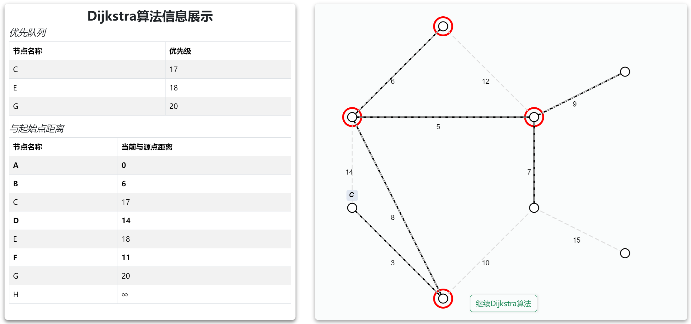
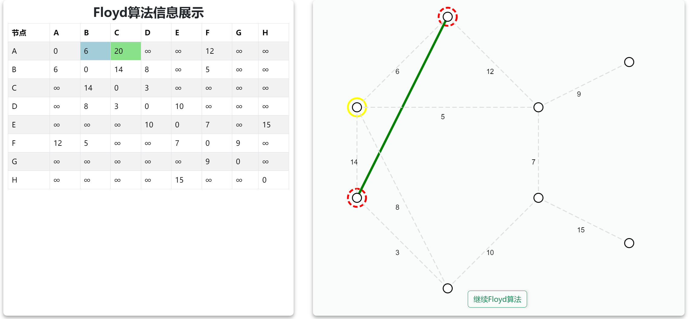
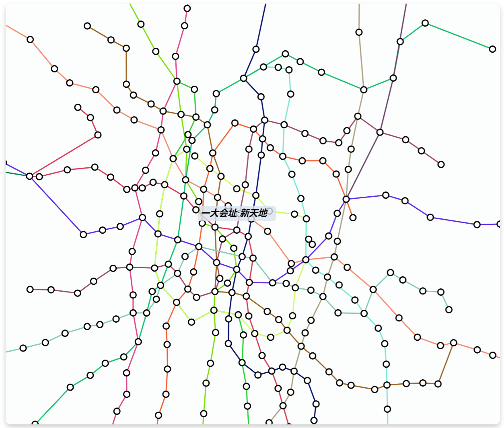
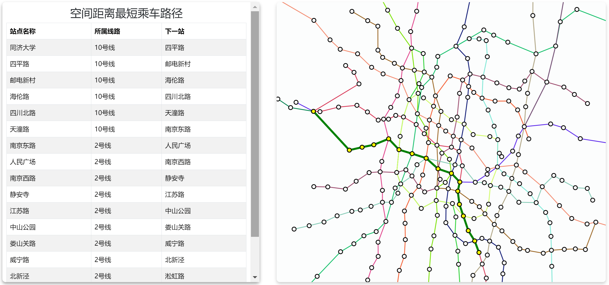

### Graph Algorithm Visualization
This is a project built with `React` and `Vite`, aimed at visualizing certain graph algoritms to promote better understanding.
##### Usage
after cloning the repository, install node modules
```bash
cd repo
npm install
```
and start service on `localhost:3000`
```bash
npm run dev
```
##### Results
{width=50%}
{width=50%}
{width=60%}
{width=60%}
{width=50%}
{width=60%}
##### Algorithms
- Prim and Kruskal for MST
- Dijkstra for single source shortest path
- Floyd-Warshall for all pairs shortest path
##### Shanghai Metro Line Visualization
- We also built visualization for Shanghai Metro Lines, and support checking for transfor routes.
- The json file for metro lines and stations are stored in `./src/assets/`, feel free to download and visualize data in your preferable way.